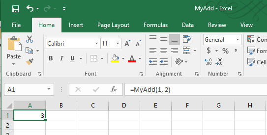
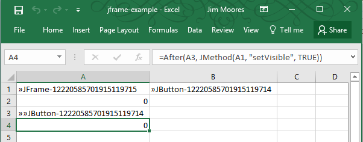
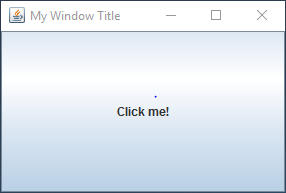
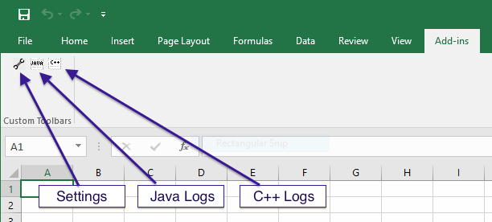

XL4J - Native Excel XLL Add-ins in Java
=======================================

**THIS PROJECT IS PRE-RELEASE, THE BETA RELEASE IS COMING NEXT WEEK**

*[Sign up to be notified when the project is opened for public beta](https://www.mcleodmoores.com/signup)* or visit the 
[XL4J Commercial Site](https://www.mcleodmoores.com/xl4j) for more information.

# Introduction
XL4J is a Java and native code library that allows you to build native-quality Excel Add-ins using only standard Java tooling (Maven + JDK).  It lets you write high performance custom Excel functions and commands for end users, but also works as a dynamic rapid application development tool in its own right.

In addition to supporting the standard Excel types (numbers, strings, dates, booleans, etc.) it also supports Java objects in the form
of object handles.  This means you can store any complex object in a single Excel sheet cell, allowing much more complex applications.  A background incremental garbage collector prevents discarded and overwritten objects from hanging around.
# Table of contents
 - Overview (this document)
   - [Objectives](#objectives)
   - [Requirements](#requirements)
   - [Features](#features)
     - [Writing Excel user-defined functions](#writing-excel-user-defined-functions)
     - [Calling constructors and methods on Java objects](#calling-constructors-and-methods-on-java-objects)
     - [Configuration and easy logging access](#configuration-and-easy-logging-access)
     - [Deployment features](#deployment-features)
     - [Add-in features](#add-in-features)
   - [Roadmap](#roadmap)
     - [Features in development](#features-in-development)
     - [Features in the pipeline](#features-in-the-pipeline)
   - [Limitations](#limitations)
 - [Settings & Configuration](docs/settings.md)
 - [Logging](docs/logging.md)
 - [Tutorial](docs/tutorial.md)
 - [Hints & Tips on Writing Add-ins](docs/hints-and-tips.md)
 - [Debugging & Troubleshooting](docs/debugging.md)
 - [API Reference](docs/api-reference.md)
 - [Native code structure & Walkthrough](docs/native-code.md)
 - [Background about Excel Types for Developers](docs/excel-types-primer-for-developers.md)
 
# Objectives
 - Make no compromises 
   - allowing developers to access any functionality they would be able to through a pure native XLL project written in C++.  This 
     means you don't have to choose between convenience and power.
 - Make it easy
   - Put your data where your users are using it and hugely increase productivity and reduce development cycles by making it really 
     easy to expose data to users without complex and inflexible UI engineering.  
   - super easy to start development - just annotate a method with @XLFunction and watch XL4J do the rest.
   - super easy deployment - just create a Maven project, include a dependency and maven assembly file and build the Add-in directory
     or deploy to a maven repository.
 - Production-grade
   - make consideration of real-world production usage with XCOPY install, access to logs, pre-deployment configuration, etc.
 - Reasonable licensing
   - Dual license GPL/Commercial means you can get your feet wet without an up-front commitment and use in personal or 
     open source projects without payment.
   - Each commerical license provides perpetual Add-in distribution and source code license for latest version at time of purchase.
   - Per developer-seat licensing, with royalty-free end-user licensing (you pay per developer, not per deployment).
   
# Requirements
 - Build requirements
   - Java modules (most users will only ever need to use the Java modules as dependencies)
     - JDK8 is required to build all modules, although only one example package actually requires JDK8 so modification for JDK7 is 
       trivial
     - Maven 3.2+ (although it should be possible to use Gradle or Ant/Ivy with very few alterations)
   - Native modules (most users will not need to build the native modules)
     - Visual Studio 2013 AND Visual Studio 2015 are required if you wish to rebuild them.  The free Community Editions are probably 
       enough although all development is done on the Enterprise edition.
 - Runtime requirements
   - Java 8 Runtime Environment (or 7 with minor adjustments).  
     - Bitness must match Excel version. 
   - Excel 2010, 2013 or 2016.  
     - 32-bit builds are fully tested, 64-bit builds are experimental but do work.
 - Windows 7, 8, 8.1 or 10.  Only 64-bit versions are tested but 32-bit versions should be fine.
     - Builds may run on Windows Vista, but it is unsupported.  
     - Windows XP is not supported.

# Features
## Writing Excel user-defined functions
 - System will automatically scan your code for @XLFunction annotations and register them with Excel.
   ```java
     @XLFunction(name = "MyAdd")
     public static double myadd(final double one, final double two) {
       return one + two;
     }
   ```

  
   
  See the tutorial for more complex examples that return objects and arrays, including documentation and more.
 - Automatic marshalling (conversion) from Java to Excel types and back again.
   - Primitive types (and Boxed equivalents)
   - JSR-310/Java 8 dates
   - 1D/2D Arrays
   - Full object-handling system maintains a garbage-collected heap for objects, necessary for long-running sheets
   - Support for varargs
 - All the types of functions and features normally available to Excel XLLs
   - Volatile functions `@XLFunction(volatile=true)` which are always recalculated (e.g. =TODAY()).
   - Macro-equivalent functions `@XLFunction(isMacroEquivalent=true)` run single-threaded but can call more Excel
     APIs such as those that modify other cells (useful for dumping data onto a sheet without using an array formula). **THIS ISN'T CURRENTLY HUGELY USEFUL BECAUSE CALLBACKS ARE NOT YET AVAILABLE**
   - Multi-thread safe functions `@XLFunction(isMultiThreadSafe=true)` which Excel can call from multiple calculation threads.
     This is the default.
   - Asynchronous functions `@XLFunction(isAsynchronous=true)` which enable long-running operations to not block Excel
 - Call XLL API from different contexts
   - XLL API calls can be made from the caller's Excel calculation thread or from the Excel main thread depending on context required.  
     Excel documentation specifies that many API calls can only be safely made from the main Excel thread. **CURRENTLY IN DEVELOPMENT**
 
## Calling constructors and methods on Java objects
The follwing example allows you to create and show a Swing JFrame with no coding at all:

|   | A                                                      |                          B                        |
|---|:------------------------------------------------------:|:-------------------------------------------------:|
| 1 | `=JConstruct("javax.swing.JFrame", "My Window Title")` | `=JConstruct("javax.swing.JButton", "Click me!")` |
| 2 | `=JMethod(A1, "setSize", 300, 200)`                    |                                                   |
| 3 | `=After(A2, JMethod(A1, "add", B1))`                   |                                                   |
| 4 | `=After(A3, JMethod(A1, "setVisible", TRUE))`          |                                                   |

which looks like this in Excel - note the object handles with the >> prefix followed by the type and the handle number:



Breaking this example down:
 - The `JConstruct` function calls the named class's constructor with any supplied arguments and returns an object handle.  The first
   constructor that the system is able to convert the argument list for will be chosen.
 - The `JMethod` function calls a method named in the second argument on the object handle passed in as the first argument with
   any subsequently supplied parameters.  The first method that the system is able to convert the argument list for will be chosen.
 - The `After` function is a utility function that allows you to specify that this cell should be evaluated after another one.  In this
   case it allows us to specify that we want the `add` method called after the `setSize` method, and the `setVisible` method after that.
   If we don't do this, we can find that Excel can choose an ordering we didn't want.  Note this is only really an issue when we're 
   side-effecting a java object, which we should generally avoid anyway.
   
Evaluating the sheet results JFrame appearing:



## Configuration and Easy Logging Access
By default there are toolbar icons for opening the settings dialog, and opening the Java and C++ Logs in Notepad (or default 
`.log` file viewer).  These can be disabled for end users if preferred.
 - Support for custom tool icons on the Add-in ribbon via a super-simple extension to the configuration file. **CURRENTLY IN DEVELOPMENT**
 
 
 
## Deployment features
 - Zero-install (a.k.a. XCOPY install) works for non-Adminstrator users who lack permission to install software - you 
   just copy the files, point Excel at the .xll file using the Add-in manager, and off you go.
 - Allow hosting installation files on a network share where they can be easily updated.
 - No COM registration, no registry modifications whatsoever.
 - No manually-run background server.
 - Installation can be custom configured to hide configuration and developer options from end users.
 - White labelling.  Add-in name can be changed by simply renaming XLL file.
 - In-built access to logs without digging around in Temp directories or CLI windows.
 
## Add-in features
 - Non-blocking background function registration means Excel doesn't blacklist your Add-in for extended startup times.
 - Mark-and-sweep style garbage collector allows long running data-driven spreadsheets to keep memory requirements stable.
 - Support for all Excel function types
   - Macro-equivalent (single-threaded, but allows certain extra features)
   - Multi-threaded
   - Volatile
   - Asynchronous (** in development **)
 - Easy-to-use configuration dialog allows
   - Custom VM options, with common options available via tick-box (max heap, remote debugging, JNI checks, logging level) 
     meaning you don't have to remember the options.
   - Add items to classpath individually, multi-select or scan a whole folder for jars.
 - Auto-detects existing installed JVM enabled via the Java control panel applet.
   - Bundled JVMs coming soon.
  
# Roadmap
## Features in development
There are various architectural choices that have been made to enable specific future features.  These features can be considered the
highest priority:
  - Bundled JVM.  Allow inclusion of a JVM with the installation files meaning user does not have to even know Java is used and 
    simplifying deployment.  Should be relatively simple.
  - Out-of-process JVM.  This is relatively easy given the JVM is implemented as a COM object and all interaction is already 
    via only COM types and interfaces.
    - Allows multiple JVMs.
    - No memory limitations.
    - Multiple XL4J add-ins at the same time.
    - Good performance due to highly optimized Windows LPC mechanism which uses shared memory for IPC when appropriate.
  - Excel high-performance XLL C API access that can provide all kinds of extra functionality.  Important that these functions can be 
    called back from the calling thread.  This is a tricky requirement in the out-of-process context, but a method to achieve it has
    already been found.
    - Access to caller information (e.g. which cell or cells are being computed).
    - Read and write data into arbitrary cells without using array formulas (only certain types of function are allowed 
      to do this).
    - Evaluate arbitrary Excel formulas.
    - Schedule commands to be called after a given period of time (possibly repeatedly).
    - Add custom dialog boxes, menus, toolbars (although this functionality is probably best achieved in other ways).
    - Much more...
  - Toolbar support - allow the simple addition of new toolbar buttons linked to custom commands.  See below for full ribbon support.
  - Per-cell exception display.  Allow developer to double-click on cell that caused error and see the last Exception + stack trace
    thrown in that cell.
    
## Features in the pipeline
These are features we know how to implement but aside from identifying what is required, nothing has been started yet.
  - COM RTD server to allow real-time data to be pushed from Java into Excel.
  - General COM API access - The most comprehensive API for Excel access is via the COM API.  The COM API allows things not available 
    via the XLL API, such as ability to format cells, recalculate cells and ranges, and much more.  So why not only provide COM access? 
    The reason is that the COM API can be rather slow, and there are still some things that can only be done via the XLL C API.
  - Heap serialization to XLS file on save/load.
  - Full Ribbon support.  Ribbon support requires more COM integration as a pre-requisite.
  - Easy exposing of user defined functions to VBA.
  - Dynamic class updating - support dynamic updaing of classes by your IDE feeding through to the Add-in without a restart.
  - Dynamic class addition - fully dynamic updates including adding and removing new functions at run-time (a la JRebel).
  - Object inspector pop-up window.
  - Excel help topics from JavaDocs.
  - Argument hints using tooltips.
  - Arbitrary Java REPL style (e.g. `=Java("MyClass obj = MyClass.of($1)", A1); return obj.getCount();`).
   
# Limitations
There are a few limitations with the current build.  These should slowly disappear with time.
  - Excel 2010 is the minimum supported version.  
    - This is the first version to support asynchronous functions, which allow us to avoid a psuedo-asynchronous framework to support
      Excel 2007.  Additionally, Excel 2007 has some nasty bugs prior to the first service packs and is going out of support early 2017.
    - Versions prior to 2007 don't support multi-threading at all, support much smaller sheets, and don't have Unicode support.
  - The JVM has a limitation of one JVM per process.  This means you cannot install more than one XL4J-based Add-in at the same time.
    Because the JVM interface is a pure COM interface, it will be relatively easy to switch to an out-of-process version within the
    first updates.
  - No ribbon support currently, toolbar uses the C API, which doesn't fully support the ribbon functionality.  It should be possible
    to build a wrapper XLA to install a ribbon if needed before official support is added.
  - 32-bit JVM limits maximum heap as it needs to share address space with Excel.  This will go away once we move to an 
    out-of-process JVM with the first updates.
  - 64-bit Add-in/JVM combination builds and appears fine but hasn't been as tested as the 32-bit build.
